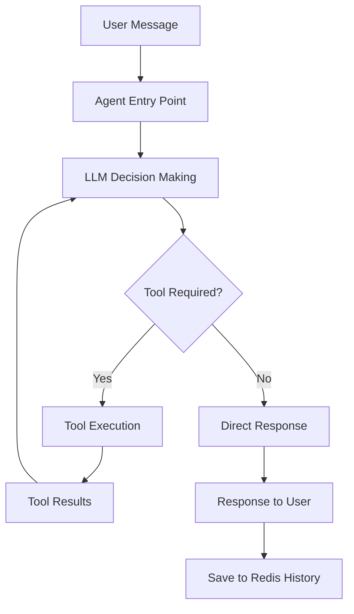

# 🤖 Sweet Shop AI Chatbot Service

<div align="center">

[](https://incubyte.vinitborad.com)
[](#-crafting-tools)
[](#-crafting-tools)
[](#-crafting-tools)
[](#-crafting-tools)
[](#-crafting-tools)

## 🎯 Checkout my craft at: [https://incubyte.vinitborad.com](https://incubyte.vinitborad.com)

</div>

## 🚨 Clarifications

- I dont have used AI to code things, but I have used AI to learn things.
- I have created higly test converaged AI chatbot infrastructure using modern LangGraph and FastAPI.
- I would love to spend more time to craft more functionalities in this chatbot like Voice Interaction, Multi-language Support, Advanced Analytics, etc.

### 🔗 Complete Project Ecosystem
This is the **AI Chatbot Service** repo of our sweet shop ecosystem:
- 🤖 **Chatbot**: This repository (RAG-based AI Agent using LangGraph & OpenAI)
- 🎨 **Frontend**: Check out [incubyte-project-frontend](https://github.com/vinitborad/incubyte-project-frontend) for frontend of sweet shop built using NextJS/React
- 🔧 **Backend**: Check out [incubyte-project-backend](https://github.com/vinitborad/incubyte-project-backend) for backend API built using Express.js & MongoDB

## ⚡ Crafting Tools

Crafted using Python, FastAPI, LangChain/LangGraph, OpenAI, Redis, MongoDB, Docker, Pytest for TDD, and containerization:
- **AI Framework**: LangChain, LangGraph for agent orchestration
- **Language Model**: OpenAI GPT-4 for natural language understanding
- **Backend**: FastAPI, Python 3.11
- **Memory**: Redis for chat history and session management
- **Database**: MongoDB integration for sweet inventory access
- **Testing**: Pytest with comprehensive test coverage
- **DevOps**: Docker, Multi-stage builds for optimization
- **Package Manager**: pip with requirements.txt

## 🛠️ Features

### Core AI Capabilities
- 🧠 **Intelligent Conversation**: Advanced natural language understanding using GPT-4
- 🔄 **Agent Orchestration**: LangGraph-powered decision making and tool execution
- 💬 **Chat History**: Persistent conversation memory using Redis
- 🛒 **Smart Shopping Assistant**: AI-powered sweet browsing and purchase assistance
- 🔍 **Inventory Integration**: Real-time access to sweet shop inventory
- 🎯 **Context Awareness**: Maintains conversation context across sessions

### AI Agent Tools
- 🍬 **get_available_sweets**: Fetches current inventory from backend API
- 🛍️ **buy_sweet**: Processes purchases through backend integration
- 💰 **Currency Awareness**: Displays prices in Indian Rupees (₹) with proper formatting
- 🔐 **Session Management**: Secure session-based chat history

### API Endpoints

| Method | Endpoint | Description |
|--------|----------|-------------|
| `POST` | `/chat` | Main chat endpoint for AI agent interaction |

#### Request Format
```json
{
  "message": "Show me available sweets",
  "session_id": "unique-session-identifier"
}
```

#### Response Format
```json
{
  "response": "Here are our available sweets: Gulab Jamun (₹25), Rasgulla (₹20)..."
}
```

## 🚀 Quick Start

### Prerequisites
- **Python** (v3.11 or higher)
- **Redis** (for chat history)
- **MongoDB** (for inventory access)
- **OpenAI API Key**

### Installation

1. **Clone the repository**
   ```bash
   git clone https://github.com/vinitborad/incubyte-project-chatbot.git
   cd incubyte-project-chatbot
   ```

2. **Create virtual environment**
   ```bash
   python -m venv venv
   
   # Windows
   venv\Scripts\activate
   
   # Linux/Mac
   source venv/bin/activate
   ```

3. **Install dependencies**
   ```bash
   pip install -r requirements.txt
   ```

4. **Set up environment variables**
   ```bash
   cp .env.example .env
   ```
   Update `.env` with your configuration:
   ```env
   OPENAI_API_KEY=your_openai_api_key_here
   REDIS_URL=redis://localhost:6379
   MONGO_URI=mongodb://localhost:27017/sweet-shop
   API_BASE_URL=http://localhost:5000
   FRONTEND_URL=http://localhost:3000
   ```

5. **Start the application**
   ```bash
   # Development
   uvicorn main:app --reload --port 8000
   
   # Production
   uvicorn main:app --host 0.0.0.0 --port 8000
   ```

### 🧪 Running Tests

```bash
# Run all tests
pytest

# Run tests with coverage
pytest --cov=. --cov-report=html

# Run specific test categories
pytest -m unit          # Unit tests only
pytest -m integration   # Integration tests only

# Watch mode for development
pytest-watch
```

## 📁 Project Structure

```
chatbot/
├── main.py                       # FastAPI application entry point
├── chatbot.py                    # LangGraph agent implementation
├── tools.py                     # AI agent tools (buy_sweet, get_available_sweets)
├── database.py                  # MongoDB connection and utilities
├── generate_graph.py            # Agent graph visualization utility
├── agent_graph.png              # Visual representation of AI agent flow
├── tests/
│   ├── __init__.py
│   ├── conftest.py              # Pytest configuration and fixtures
│   ├── test_chatbot.py          # Agent graph and core logic tests
│   ├── test_main.py             # FastAPI endpoint tests
│   ├── test_tools.py            # AI tools functionality tests
│   ├── test_database.py         # Database integration tests
│   ├── test_integration.py      # End-to-end integration tests
│   └── test_performance.py      # Performance and load tests
├── requirements.txt             # Production dependencies
├── requirements-dev.txt         # Development dependencies
├── pytest.ini                  # Test configuration
├── Dockerfile                  # Multi-stage production build
├── ENVIRONMENT.md              # Environment setup guide
├── TESTING_SIMPLE.md           # Testing documentation
└── README.md                   # You are here! 📍
```

## 🤖 AI Agent Architecture

This chatbot uses a sophisticated LangGraph-based architecture:



### Key Components
- **StateGraph**: Manages conversation flow and state
- **System Prompt**: Provides context about sweet shop and currency
- **Tool Integration**: Seamless backend API integration
- **Memory Management**: Redis-based persistent chat history
- **Error Handling**: Robust error handling and user feedback

## 🚢 Deployment

### Docker Deployment
This application includes a multi-stage Dockerfile for optimized production deployment:

```bash
# Build the image
docker build -t sweet-shop-chatbot .

# Run the container
docker run -p 8000:8000 --env-file .env sweet-shop-chatbot
```

### Multi-stage Build Benefits
- 📦 **Smaller Image Size**: Optimized Python dependencies
- 🔒 **Security**: Non-root user execution
- ⚡ **Fast Startup**: Cached dependency layers

## 🎯 Future Enhancements

Given more time, I would love to extend this AI chatbot with:
- 🎤 **Voice Integration**: Speech-to-text and text-to-speech capabilities
- 🌍 **Multi-language Support**: Hindi, English, and regional languages
- 📊 **Analytics Dashboard**: Conversation analytics and user insights
- 🔔 **Proactive Notifications**: Stock alerts and personalized recommendations
- 🎨 **Rich Media**: Image recognition for sweet identification
- 🤝 **Human Handoff**: Seamless transition to human agents
- 🧠 **Advanced RAG**: Vector database integration for enhanced knowledge
- 📱 **Voice Assistant**: Integration with Alexa/Google Assistant

## 🤝 Contributing

I welcome contributions to make this AI chatbot even better! Here's how you can help:

### Development Setup
1. Fork the repository
2. Create a feature branch: `git checkout -b feature/amazing-ai-feature`
3. Make your changes following the coding standards
4. Write tests for your changes
5. Ensure all tests pass: `pytest`
6. Commit your changes: `git commit -m 'Add amazing AI feature'`
7. Push to the branch: `git push origin feature/amazing-ai-feature`
8. Open a Pull Request

### Coding Standards
- Follow existing Python patterns and PEP 8
- Maintain good test coverage for AI components
- Use meaningful commit messages and comprehensive docstrings
- Test AI agent behavior thoroughly
- Document any new tools or capabilities

## 🎉 Acknowledgments

**Big thanks to [Incubyte Consulting LLP](https://incubyte.co) to made me build this beautiful piece of AI-powered software.**

## 👨‍💻 About the Developer

### 📬 Connect With Me

<div align="center">

[](https://www.linkedin.com/in/vinitborad)
[](https://github.com/vinitborad)
[](mailto:vinitboradofficial@gmail.com)

</div>

---

<div align="center">

**⭐ If you found this AI project helpful, please give it a star!**

*Built with ❤️ by [Vinit Borad](https://github.com/vinitborad) for [Incubyte](https://incubyte.co)*

**🎯 [View Live Demo](https://incubyte.vinitborad.com) | 🎨 [See Frontend](https://github.com/vinitborad/incubyte-project-frontend) | 🔧 [See Backend](https://github.com/vinitborad/incubyte-project-backend)**

</div>
